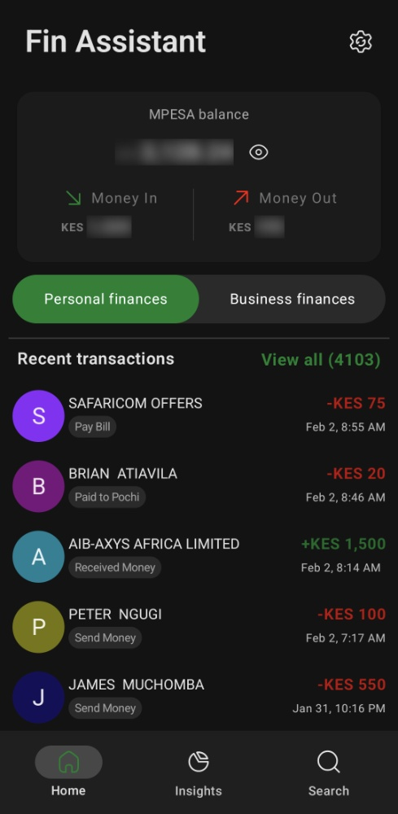
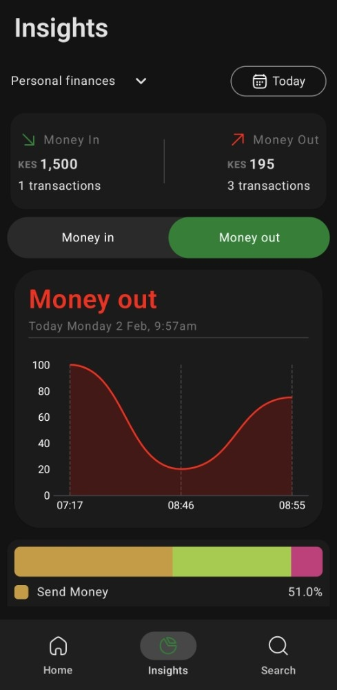
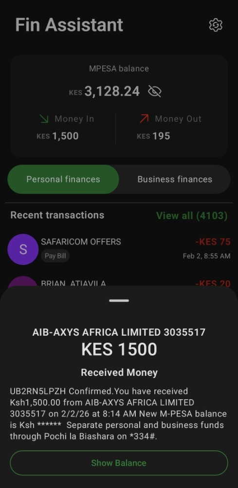
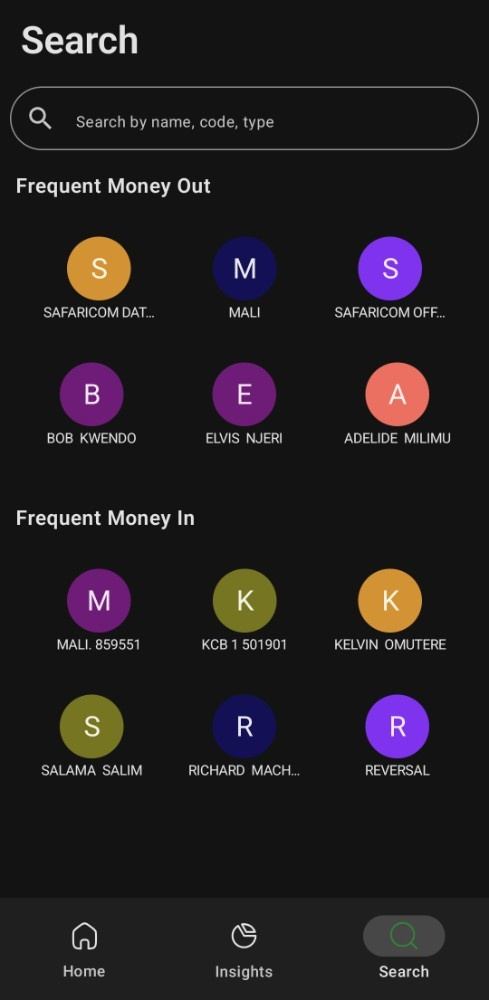
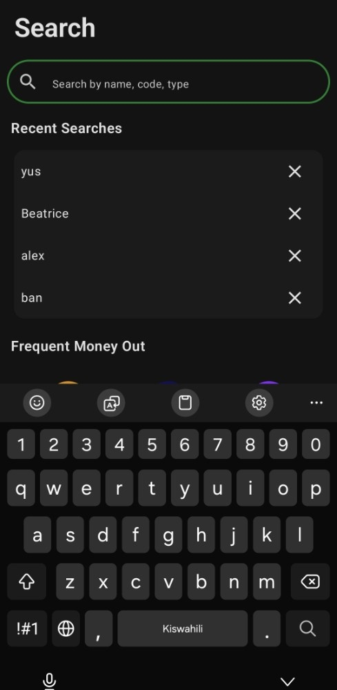
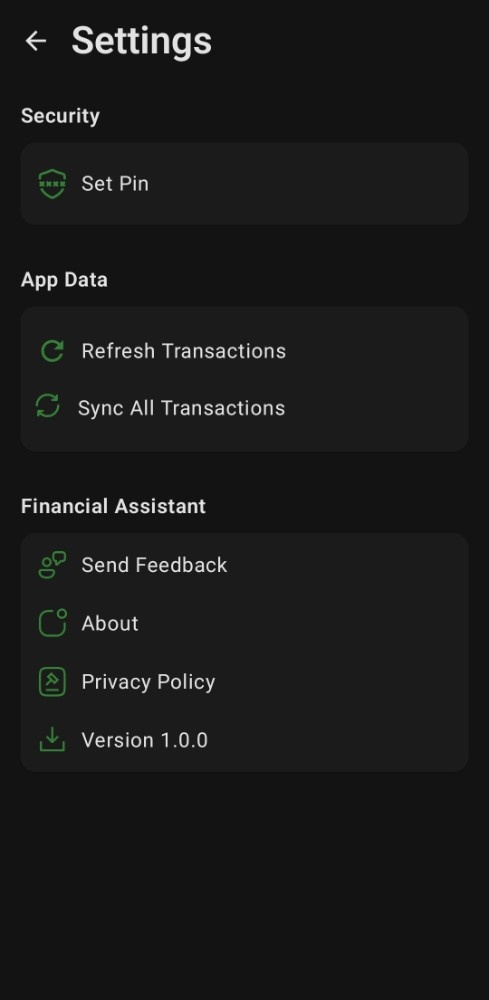
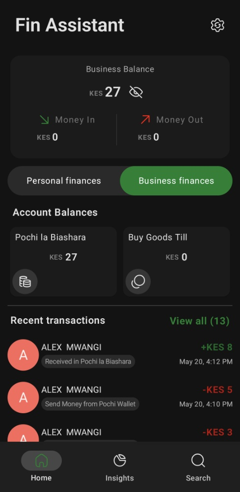

# Financial Assistant 📱💸


**An automated, privacy-first financial tracker built for the Kenyan ecosystem.**

Financial Assistant solves the problem of manual expense tracking by intelligently intercepting and parsing transactional SMS messages (M-PESA, FULIZA, Pochi). It transforms raw text data into actionable financial insights, stored securely on-device.

---

## 📸 Screenshots

|                         **Dashboard**                         |              **Analytics & Insights**               |                     **Transaction History**                      |                 **Smart Search**                  |
|:-------------------------------------------------------------:|:---------------------------------------------------:|:----------------------------------------------------------------:|:-------------------------------------------------:|
|  |  |  |  |
|                *Real-time balance & activity*                 |        *Spending trends & visual breakdowns*        |                 *Comprehensive transaction list*                 |             *Deep filtering & search*             |

|                    **Search history**                     |                    **Settings**                     |                    **Business Dashboard**                     |                     **Transaction Details**                      |
|:---------------------------------------------------------:|:---------------------------------------------------:|:-------------------------------------------------------------:|:----------------------------------------------------------------:|
|  |  |  |  |
|           *Previous searches for quick search*            |            *Customization & Preferences*            |          *Separation of business and personal funds*          |                     *In-depth receipt view*                      |
---

## 🚀 Key Features

* **Automated Transaction Logging:** Utilizes `BroadcastReceiver` and `WorkManager` to intercept and parse incoming SMS messages in the background, automatically categorizing them without user intervention.
* **Granular Analytics:** Visualizes spending habits using custom-built charts (Line & Bar graphs) to track daily, weekly, and monthly trends.
* **Native Kenyan Support:** Built-in parsing logic for local financial instruments:
    * **M-Pesa:** Send Money, PayBill, Buy Goods (Till), Withdrawals.
    * **Credit/Loans:** Fuliza, M-Shwari, KCB M-Pesa.
    * **Business:** Pochi la Biashara transactions.
* **Smart Search:** Deep search functionality to filter transactions by type, date, amount, or recipient.
* **Privacy & Security:**
    * **Offline First:** No external servers. All data is stored locally using **Room Database**.
    * **Biometric Auth:** Secure entry using Fingerprint/Face Unlock via `BiometricPromptManager`.

---

## 🛠 Technical Architecture

This project demonstrates **Modern Android Development (MAD)** best practices, focusing on scalability, modularity, and build performance.

### **Security Layer**
The application implements a multi-layered security approach to ensure user data remains private and tamper-proof.

* **AES-256 Encryption:** Sensitive local data is encrypted using `AES/GCM/NoPadding` via the `EncryptionManager`. The cryptographic keys are securely generated and stored within the **Android KeyStore** system.
* **Secure Hashing:** User PINs are hashed using **PBKDF2WithHmacSHA256** (10,000 iterations + random salt) to prevent rainbow table attacks.
* **Biometric Authentication:** Leverages Android's native `BIOMETRIC_STRONG` authenticators for hardware-backed security.

### **Advanced Engineering**
This project goes beyond standard feature implementation by utilizing advanced Android build systems and memory management strategies.

#### **1. Build Variants & Flavor Dimensions**
The project leverages **Gradle Build Variants** to create distinct application versions:
* **`default` Variant:** The consumer-facing application. Optimized for size and performance (Tracking, Analytics, Budgeting).
* **`admin` Variant:** Includes the `:feature:admin` module. Exposes exclusive tools for internal configurations and feedback analysis.
    * *Impact:* Strict code isolation. Admin logic is stripped entirely from the consumer APK.

#### **2. In-Memory Caching Strategy**
Implements a custom LRU caching layer (`AppCache`) to minimize database queries and ensure UI fluidity.
* **Implementation:** Wraps Android's native `LruCache` to manage a thread-safe, size-constrained memory buffer (Max 50 items).
* **Performance:** Frequently accessed data is cached in RAM; the system automatically evicts the "Least Recently Used" items when the limit is reached.
* **Synchronization:** All cache operations are synchronized to ensure thread safety during background SMS processing.

---

## 🏗️ Project Structure

### **Modularization Strategy**
The app is modularized by **feature** to enforce separation of concerns:

```text
:app                 -> App entry point, navigation graph
:core:data           -> Repositories, Data Sources, Mappers
:core:database       -> Room Entities, DAOs, Migrations
:core:designsystem   -> Shared Compose UI components, Theming
:core:common         -> Extension functions, Dispatchers
:feature:home        -> Dashboard & Transaction Lists
:feature:insights    -> Analytics & Charts
:feature:search      -> Search implementation
:feature:onboarding  -> User setup & Auth flow
```

### **Tech Stack**
* **Language:** Kotlin (100%)
* **UI:** Jetpack Compose (Material 3 Design System)
* **Architecture:** Clean Architecture + MVVM
* **Dependency Injection:** Hilt
* **Asynchronicity:** Coroutines & Kotlin Flow
* **Local Storage:** Room Database (SQLite) with SQL Views for unified reporting.
* **Background Tasks:** WorkManager
* **Build Logic:** Gradle Convention Plugins (`build-logic`) to centrally manage dependencies.

### **Testing Strategy**
Reliability is verified through a suite of automated tests:
* **Unit Tests:** Validating business logic in ViewModels and Repositories.
* **Instrumented Tests:** Verifying critical infrastructure (WorkManager integrity, Database Migrations).

---

## 🔧 Setup & Installation

1.  **Clone the repository:**
    ```bash
    git clone [https://github.com/richardmachage/fin-assistant.git](https://github.com/richardmachage/fin-assistant.git)
    ```
2.  **Open in Android Studio:**
    Ensure you are using Android Studio Koala (2024.1.1) or later.
3.  **Sync Project:**
    The project uses a `libs.versions.toml` version catalog. Allow Gradle to sync.
4.  **Select Build Variant:**
    Open the "Build Variants" tab and select `defaultDebug` for the standard app or `adminDebug` for the internal tools version.
5.  **Run:**
    Connect a device/emulator and run the `app` configuration.

---

> **Note to Reader:** This project is a demonstration of capability in building complex, persistence-heavy Android applications with modern architecture. It handles sensitive user data with strict privacy controls (local-only storage) and manages complex build configurations using Gradle Convention Plugins.